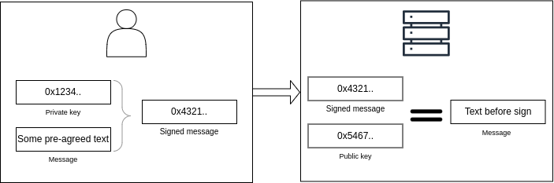

# Smart lamp control via Web3.0

<iframe width="640" height="360"
    src="https://www.youtube.com/embed/FZV0-MSSsBc?fs=2&autoplay=0" frameborder="0"
    allow="fullscreen; accelerometer; autoplay; clipboard-write; encrypted-media; gyroscope; picture-in-picture" allowfullscreen></iframe>

## **The Lights Up demo in a nutshell**

Demos play a pivotal role in engaging and enlightening individuals by offering a simplified glimpse into the practical applications of various technologies.  Robonomics introduces its Lights Up demo, which serves as an illustrative showcase of the power of decentralized technologies. Through this demonstration, users can alter the **color of a lamp** positioned within one of the Robonomics labs, all while exclusively harnessing **decentralized technologies**.

Yet, before diving into the intricacies of the Lights Up demo, it is imperative to acquaint ourselves with two fundamental concepts that underpin this innovative showcase of decentralized prowess.

## **Auth Web3 way**

In the context of **Web2**, conventional user authentication mechanisms typically involve the use of **usernames** and **passwords**, along with the customary sign-up procedures. However, the landscape shifts considerably in the realm of **Web3**, where a more streamlined, cryptographic approach comes into play. In this setting, the linchpin of user authentication becomes one's digital wallet, precisely, the **key-pair** comprising a **private** and a **public key**.

Here's how it unfolds: When authentication is required in the Web3 domain, individuals utilize their private keys to digitally sign a predetermined text message. They then present this signed message, along with their public key, as the means of verification. This approach ensures that the signed message is both authentic and contains the requisite content for authorization.

However, it's worth noting a significant **drawback** to this method. While a lost Web2 password can often be reset through centralized channels, the **loss** of a Web3 **wallet** presents a distinct challenge. Proving one's identity as the rightful owner becomes a formidable task. The same holds true in cases of **stolen** passwords and wallets – while a stolen password can be changed to regain control, the same cannot be said for a pilfered wallet, adding an extra layer of complexity to the scenario.

## **Subscription**

The conventional approach to blockchain services invariably encompasses the inclusion of transaction costs, commonly referred to as transaction fees or transaction gas. In essence, this implies that the priority of any given transaction is contingent upon the cost or fee that the user is willing to allocate to it. Put simply, the higher the fee, the swifter the transaction's processing. However, this framework falls short of catering to systems reliant on a **guaranteed bandwidth**. In such instances, the imperative is absolute certainty that one's device can execute a transaction at the designated time and at a predictable cost, a facet not commonly witnessed today due to transaction costs being inextricably tied to the vagaries of exchange rate fluctuations.

In addressing this predicament, a Subscription service has been introduced, constituting an **alternative cost model** for the Robonomics parachain. This innovative model assures the execution of a prepaid allotment of transactions, bestowing upon them a higher order of priority when juxtaposed with transactions remunerated under the conventional fee-based paradigm. Furthermore, it affords the advantage of a stable bandwidth allocation, ideally suited for accommodating the demands of a substantial **volume of monthly transactions**. It's worth noting that there limited amount of subscriptions.
